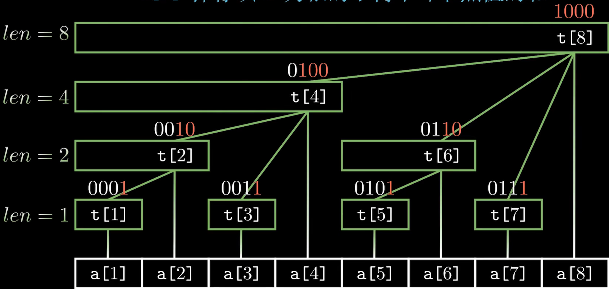
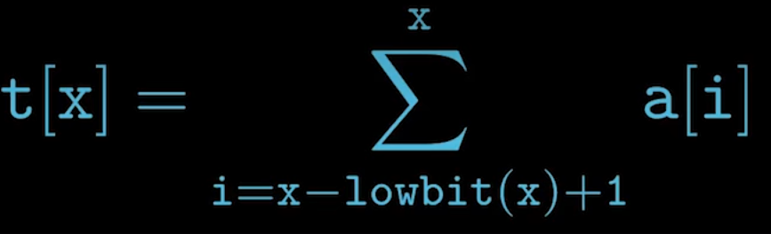

## 树状数组

- 单点修改：复杂度O(logn)
- 区间查询：复杂度O(logn)

##### 问题部分

1. 给出一个长度为n的数组，完成下面两种操作：
    1. 将第x个数加上k。
    2. 输出区间[x,y]内每个数的和。

##### 前置知识-lowbit（运算操作）

- 非整数n在二进制表示下最低位1及其后面的0构成的数值称为n的lowbit。
- lowbit(n) = n & (-n)

##### 树状数组的思想

- 
- t[x]保存以x为根的子树中叶节点值的和
- t[x]节点的长度就等于lowbit(x)
- t[x]节点的父节点为t[x + lowbit(x)]
- 整棵树的深度为log2(n) + 1
- 

```cpp
   for (int i = x; i ; i -= lowbit(i)) res += t[i];//求前缀和
   
```


