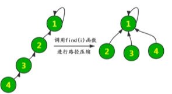
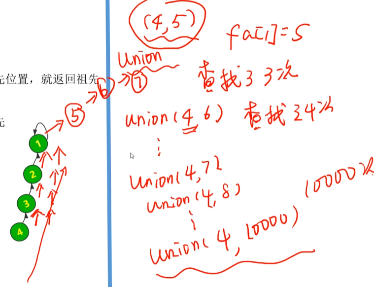

#### 性质
- 1.并查集是一种树型的数据结构，用于处理一些不相交集合的合并及查询问题（即所谓的并、查）。比如说，我们可以用并查集来判断一个森林中有几棵树、某个节点是否属于某棵树等。
- 2.并查集主要由一个整型数组pre[ ]和两个函数find( )、join( )构成。数组 pre[ ] 记录了每个点的前驱节点是谁，函数 find(x) 用于查找指定节点 x 属于哪个集合，函数 join(x,y) 用于合并两个节点 x 和 y 。
- 3.并查集的主要作用是求连通分支数（如果一个图中所有点都存在可达关系（直接或间接相连），则此图的连通分支数为1；如果此图有两大子图各自全部可达，则此图的连通分支数为2……）

### 操作
- 1.初始化：init
- 2.查询find
- 3.合并unionnn

##### 初始化操作
- 假设有编号1，2，3，...，n的n个元素，我们用一个数组fa【】来存储每个元素的父节点。一开始将他们的父节点都设为自己
```cpp
vector<int> fa[MAXN];
void init(int n ){
	for(int i = 1; i <= n;++i){
	fa[i] = i;
	}
}
```

##### 查询操作（未进行路径压缩）
- 找到i的祖先直接返回，未进行路径压缩
- 这个就是找到指向自己的那个节点，它对应的就是祖先节点
```cpp
int find(int i){
	if(fa[i] == i)//递归出口，当到达祖先位置，就返回祖先
		return i;
	else
		return find(fa[i]);//不断往上查找祖先
}
```
##### 查询操作进行路径压缩
```cpp
int find(int i){
	if(i == fa[i])
		return i;
	else{
		fa[i] = find(fa[i]);//对该步进行了路径压缩
		//递归的过程
		return fa[i];//返回父节点
	}
}
```
#### 性质
- 1.并查集是一种树型的数据结构，用于处理一些不相交集合的合并及查询问题（即所谓的并、查）。比如说，我们可以用并查集来判断一个森林中有几棵树、某个节点是否属于某棵树等。
- 2.并查集主要由一个整型数组pre[ ]和两个函数find( )、join( )构成。数组 pre[ ] 记录了每个点的前驱节点是谁，函数 find(x) 用于查找指定节点 x 属于哪个集合，函数 join(x,y) 用于合并两个节点 x 和 y 。
- 3.并查集的主要作用是求连通分支数（如果一个图中所有点都存在可达关系（直接或间接相连），则此图的连通分支数为1；如果此图有两大子图各自全部可达，则此图的连通分支数为2……）

### 操作
- 1.初始化：init
- 2.查询find
- 3.合并unionnn

##### 初始化操作
- 假设有编号1，2，3，...，n的n个元素，我们用一个数组fa【】来存储每个元素的父节点。一开始将他们的父节点都设为自己
```cpp
vector<int> fa[MAXN];
void init(int n ){
	for(int i = 1; i <= n;++i){
	fa[i] = i;
	}
}
```

##### 查询操作（未进行路径压缩）
- 找到i的祖先直接返回，未进行路径压缩
- 这个就是找到指向自己的那个节点，它对应的就是祖先节点
```cpp
int find(int i){
	if(fa[i] == i)//递归出口，当到达祖先位置，就返回祖先
		return i;
	else
		return find(fa[i]);//不断往上查找祖先
}
```
##### 查询操作进行路径压缩
```cpp
int find(int i){
	if(i == fa[i])
		return i;
	else{
		fa[i] = find(fa[i]);//对该步进行了路径压缩
		//递归的过程
		return fa[i];//返回父节点
	}
}
```
- ![[Pasted image 20241027131237.png]]

##### 合并
```cpp
void unionn(int i , int j){
	int i_fa = find(i);//找到i的祖先
	int  j_fa = find(j);//找到j的祖先
	fa[i_fa] = j_fa;//i的祖先指向j的祖先
}
```



##### 合并
```cpp
void unionn(int i , int j){
	int i_fa = find(i);//找到i的祖先
	int  j_fa = find(j);//找到j的祖先
	fa[i_fa] = j_fa;//i的祖先指向j的祖先
}
```

